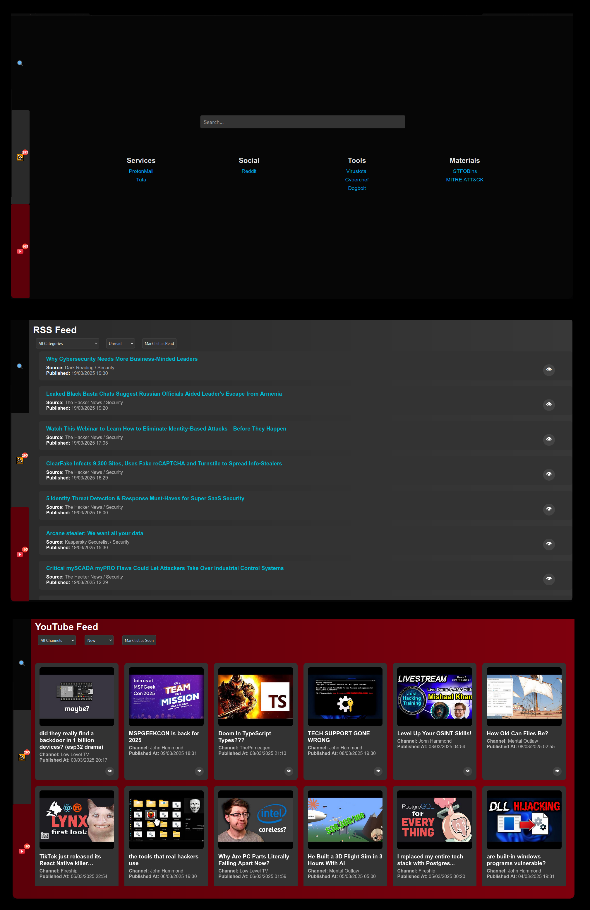

# StartPage
A simple start page that gives a minimal search bar and a few quick links. It is also a RSS/Atom feed and Youtube feed aggregator. 

## Installation:
- The application only requires a binary/executable and a configuration file to work. Additionally a database file (sqlite) and log file is created in the configuration folder. These are the only artifacts you need to care about if you choose to uninstall the application.
- **Note**: The database file and log file will be created by the application by itself in the config directory. 
### Linux:
- Grab the `.bin` executable from [releases](https://github.com/ItsMonish/StartPage/releases/latest) section. And put it in some directory that is included in the `$PATH` variable such as `$HOME/.local/bin` 
- Create a directory in user configuration home `$XDG_CONFIG_HOME` which usually is `$HOME/.config`. Name the new directory as `startpage` and create `config.yml` inside the directory. The default configuration is provided at [config.yml](https://raw.githubusercontent.com/ItsMonish/StartPage/refs/heads/master/config/config.yml) with required hints on how to use it.
- Now depending upon your WM/DE, this step may differ:
	- Check how WM/DE implements starting programs. [This](https://wiki.archlinux.org/title/Autostarting) might help.
	- If your WM/DE implements XDG Autostart, all that needs to be done is to create a `.desktop` file like [this](https://github.com/ItsMonish/StartPage/blob/master/config/example.desktop) under `$XDG_CONFIG_HOME/autostart` which usually is `$HOME/.config/autostart`.
	- Else consult your WM/DE documentation and start the application appropriately. For example, hyprland requires you to start programs using `exec-once` in `hyprland.conf`.
### Windows:
- Grab the `.exe` executable from [releases](https://github.com/ItsMonish/StartPage/releases/latest) section. And put it in some folder that you would like. 
- Next you need to create a folder `startpage` in your user configuration folder. This can be reached using the `%USERPROFILE%` environment variable. Use it with the run window or use it with the file explorer address bar. Check out [this](https://geekrewind.com/how-to-find-a-user-profile-in-windows-11/) article if you are still unsure.
- Create a config.yml inside that folder with the contents in the [default config](https://raw.githubusercontent.com/ItsMonish/StartPage/refs/heads/master/config/config.yml).
- Next add the exe executable into Windows startup application. Refer [this](https://www.howtogeek.com/208224/how-to-add-a-program-to-startup-in-windows/) article if you need help.
### Common for both at last:
- At last, set your default startup home page in your browser to `localhost:<PORT>` which by default is `localhost:8080`.
## Usage:
- Once you have this in your Autostart, it will start running every time you log into your account. 
- The quick links and feeds can be added to config.yml file as desired. Refer the comments in the default [config.yml](https://github.com/ItsMonish/StartPage/blob/master/config/config.yml) to learn more and how to add feeds and links.
- **Note**: The more feeds you add, it may take some time for the application to collect all feeds, depending on the internet speed and processing capabilities. So if you immediately open the browser after logging in, you may not see the refreshed feeds.
- You can navigate through search, RSS/Atom feed and Youtube feed using the buttons on the left.
- As for RSS/Atom and Youtube feeds, clicking on an item would mark it as read/seen and would put it in your history. You can alternatively mark items as read/seen using the eye button on the right.
- One can navigate across unread/new items, read/seen items and favourites.  You can add read/seen items to favourites by clicking the star button on the right.
- **Note**: If you would like to change the look and feel of the application, you need to make changes to source code files and build the application yourself. All the web assets and source files are embedded into the binary/executable.
### Youtube Feed?
- Youtube actually exposes a RSS media feed for every channel on the URL `https://www.youtube.com/feeds/videos.xml?channel_id=<channel ID>`. However getting the channel ID is not that straight forward.
- You can view the source of the channel page and search for `channelId` and you'll most likely see a string starting with `UC`. That's the channel ID.
- Or you could use a bash one liner that I put together to get the link nice and easy.
```bash
curl -s "channel link goes here" | grep -o 'https://www\.youtube\.com/channel/[a-zA-Z0-9_-]*' | uniq | awk -F/ '{print "https://www.youtube.com/feeds/videos.xml?channel_id="$5}'
```
- Or for windows users, here is a powershell equivalent one liner:
```powershell
Invoke-WebRequest "channel link goes here" -UseBasicParsing | Select-String -Pattern 'https://www\.youtube\.com/channel/[a-zA-Z0-9_-]*' | ForEach-Object { $_.Matches.Value } | Sort-Object -Unique | ForEach-Object { "https://www.youtube.com/feeds/videos.xml?channel_id=$($_.Split('/')[4])" }
```
## Credits:
I am not very comfortable with frontend designing. So the base HTML and CSS of the application that is presented was built by ChatGPT, upon which I made changes and tweaks to make it look like it is now. Still gotta give where credit is due.
